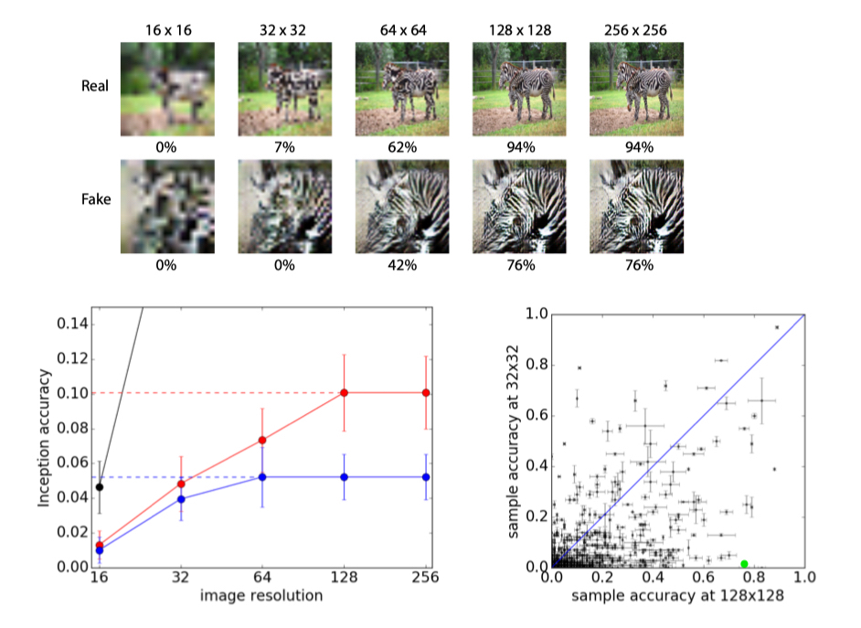
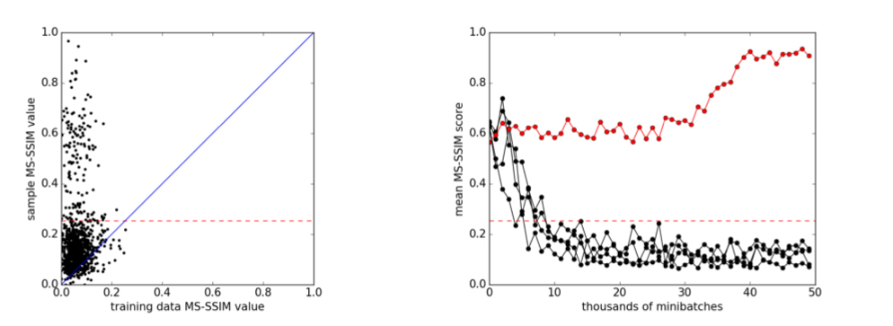

# [Conditional Image Synthesis with Auxiliary Classifier GANs](http://arxiv.org/abs/1610.09585)

## Statement

* Inception score is not sufficient to measure diversity

## Contribution

* propose a new conditional gan with added class loss function
* prove high resolution images improves discriminability
* use MS-SSIM as a measure of diversity 

## Apporach

$D$ is trained to maximize $L_s + L_c$ while $G$ to maximize $L_c - L_s$.

$L_s = E[logP(S=real|X_{real})] + E[logP(S=fake| X_{fake})]$,
$L_c = E[logP(C = c | X_{real})] + E[logP(C=c|X_{fake})]$

## Experiment

This shows GAN that generates higher resolution images, even when downsampling to a lower resolution, it still has higher inception accuracy

Lower pair-wise MSSSIM means lower similarity between luminance, contras and structure. The trained model is shown to have lower MSSSIM comparing to training data per class. Thus the variability is guarantted.

## Pros & Cons

### Pros

* MS-SSIM to measure variability is novel and simple, a good measure for model varaibility
* the conclusion that higher resolution images carry more class information is important

### Cons

* from experiment, it seems that the model does not do well. (Inception accuracy is low)
* pair-wise MS-SSIM might be cumbersome. Besides, it does not provide code for formula how they get the results
